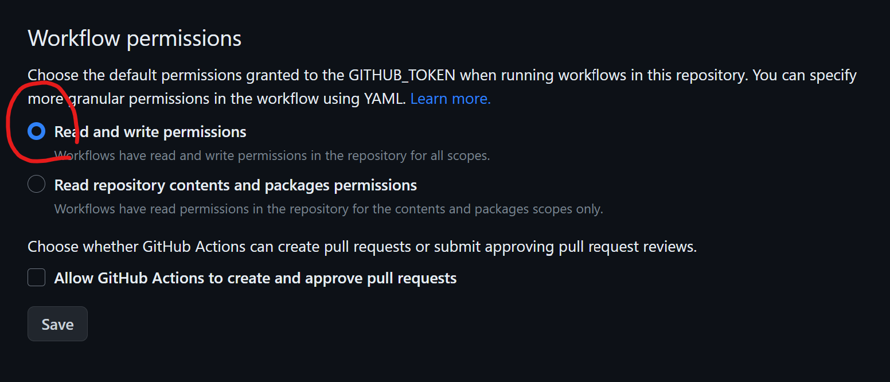
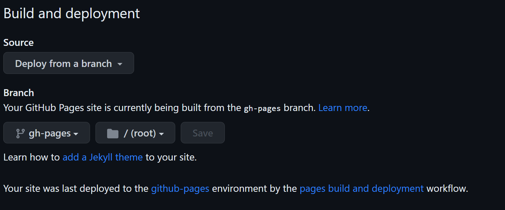

# ncu-env-data-science-template

Repository hosting the template notebook for the term projects of the course RS5046/GP5024: Environmental data science (環境資料科學). 

## How to use the content

You can either:

1. download the entire repository as a zip file, set up a new repository under your own GitHub account, and extract the zipped content to the repository; or
2. fork this repository.

## How to make the automatic GitHub Page deployment work

We can create an automatic workflow on GitHub to run Jupyter Book and deploy the HTMLs to GitHub Pages every time you push any new content.

On the Github repository site, make sure you have the GitHub workflow permission set to both read and write by going to Settings -> Actions -> Workflow permissions, as this figure shows:

Next, commit and push the template content (remember to include the hidden `.github/workflows/build.ylm`). Wait a minute or two until the yellow dot on your repository landing page turns into a green check mark:

Now go to Settings -> Page. Adjust the settings as this figure shows:

Wait a minute or two again, and refresh the page. Now you should be able to see the message saying the Notebook has been published on your GitHub pages at https://[YOUR_ACCOUNT_NAME].github.io/[REPOSITORY_NAME]!